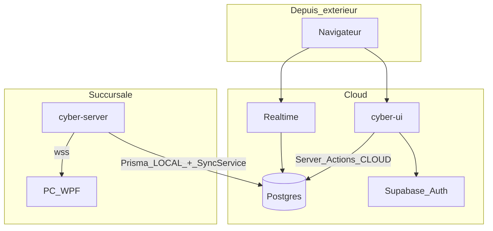

# Architecture Siège / Succursale

Ce document décrit comment CyberControl est branché entre le **siège (cloud)** et les **succursales (edge local)**, et comment piloter une succursale **depuis l'extérieur** sans être sur le réseau du cybercafé.

## Guides associés

| Guide | Contenu |
|-------|---------|
| [INSTALLATION-DISTANCE.md](INSTALLATION-DISTANCE.md) | Supabase, Vercel, migrations, utilisation caisse à distance |
| [INSTALLATION-LOCALE.md](INSTALLATION-LOCALE.md) | Edge **Docker** (recommandé), PC WPF, réseau |

## Modèle général

| Rôle | Composant | Où ça tourne |
|------|-----------|----------------|
| Siège | `cyber-ui` | Cloud (Vercel) |
| Pont | Supabase Postgres + Realtime + Auth | Cloud |
| Succursale | `cyber-server` | Conteneur Docker au cybercafé |
| Postes | `cyber-client` (WPF) | PC Windows |

Supabase est la **source de vérité** partagée. L'UI cloud et le serveur edge lisent/écrivent la même base. Le temps réel Supabase remplace l'ancien WebSocket dashboard vers le serveur local.

## Schéma global



## Connexion depuis l'extérieur

Aucun VPN vers le cybercafé n'est requis pour utiliser la caisse à distance. Procédure détaillée : [INSTALLATION-DISTANCE.md § Utiliser la caisse](INSTALLATION-DISTANCE.md#3-utiliser-la-caisse-depuis-lextérieur).

### Étapes

1. **Ouvrir l'UI** — production : `https://votre-projet.vercel.app/login` ; dev : `http://localhost:3000/login`
2. **Se connecter** via Supabase Auth (email + mot de passe). Comptes par défaut après `db:seed` + `db:seed:auth` :
   - `admin@cybercontrol.local` / `admin123` (ADMIN — tous les établissements)
   - `staff@cybercontrol.local` / `staff123` (STAFF — cybers assignés)
3. **Choisir la succursale** dans le sélecteur du header (`cyberId` actif). Implémenté dans [`cyber-ui/lib/cyber-context.tsx`](../cyber-ui/lib/cyber-context.tsx).
4. **Utiliser `/dashboard`** — vente de tickets, sessions libres, grille des postes.

Le sélecteur filtre toutes les données (Realtime, Server Actions) sur le `cyberId` choisi. Un admin peut basculer entre succursales ; un staff ne voit que les cybers assignés dans `app_metadata.cyberIds` (voir [`cyber-ui/app/actions/auth.ts`](../cyber-ui/app/actions/auth.ts)).

### Prérequis côté succursale

Pour que les actions distantes atteignent les PC, le serveur edge de **cette** succursale doit être en ligne avec :

- `EDGE_CYBER_ID` = le `cyberId` sélectionné dans l'UI
- `SUPABASE_URL` + `SUPABASE_SERVICE_ROLE_KEY` (écoute Realtime)
- `DATABASE_URL` (même projet Supabase que l'UI)

Sans edge actif, la caisse cloud peut lire/écrire en base, mais les ordres ne sont pas relayés aux PC.

## Flux technique par action

| Action | Côté UI | Écriture base | Relay edge |
|--------|---------|---------------|------------|
| Voir la grille | Supabase Realtime ([`use-supabase-postes.ts`](../cyber-ui/lib/use-supabase-postes.ts)) | lecture `SessionOrdinateur`, `Ticket`, `PostePresence` | — |
| Vendre un ticket | Server Action ([`app/actions/sessions.ts`](../cyber-ui/app/actions/sessions.ts)) | `sourceMiseAJour=CLOUD` | [`SupabaseSyncService`](../cyber-server/src/supabase/supabase-sync.service.ts) → `sendToPc` |
| Démarrer / arrêter session libre | Server Action | `CLOUD` | `unlock_success` ou `command_lock` |
| Encaisser session libre | Server Action | `CLOUD` | `command_lock` |
| Poste jaune (connecté) | Realtime `PostePresence` | edge écrit en `LOCAL` ([`pc.service.ts`](../cyber-server/src/pc/pc.service.ts)) | — |
| Décompte prépayé | Realtime `SessionOrdinateur` / `Ticket` | edge Master Timer en `LOCAL` | — |

### Mécanisme `sourceMiseAJour`

Chaque mise à jour de `SessionOrdinateur` porte une origine :

- **`CLOUD`** — écriture depuis l'UI (Server Actions Vercel)
- **`LOCAL`** — écriture depuis le serveur edge (timers, actions PC, heartbeat)

Le relay edge n'écoute que les changements **`CLOUD`** :

```typescript
// cyber-server/src/supabase/supabase-sync.service.ts
if (source !== SourceMiseAJour.CLOUD) {
  return; // pas de relay pour les écritures locales
}
```

Cela évite les boucles : l'edge ne renvoie pas vers les PC les mises à jour qu'il a lui-même produites.

### Relay cloud → PC

Quand l'UI écrit `EN_COURS` (prépayé ou post-payé) avec `sourceMiseAJour=CLOUD`, `SupabaseSyncService` envoie aux PC connectés :

- `unlock_success` — déverrouillage
- `time_update` — temps restant (prépayé)
- `command_lock` — verrouillage (`A_PAYER`, `VERROUILLE`)

Les PC sont joints via WebSocket local ; le dashboard n'utilise plus ce canal.

## Ce qui tourne à la succursale

Chaque cybercafé physique = **une machine Docker** avec `cyber-server` (voir [INSTALLATION-LOCALE.md](INSTALLATION-LOCALE.md) — §1 Docker recommandé) :

| Élément | Configuration |
|---------|---------------|
| Serveur edge | `npm run edge:up` — `EDGE_CYBER_ID` unique (ex. `cyber_demo_nord`) |
| Connexion cloud | `SUPABASE_URL`, `SUPABASE_SERVICE_ROLE_KEY`, `DATABASE_URL` |
| PC WPF | `appsettings.json` : `ServerHost` = IP/host Docker, port `5001` (ou reverse proxy TLS) |
| WebSocket PC | `ws://host:5001/cyber?cyber=CYBER_ID&poste=N` (ou `wss://` en prod) |

Le dashboard **ne peut plus** se connecter en WebSocket local. Les connexions `?role=dashboard` sont refusées dans [`pc.gateway.ts`](../cyber-server/src/pc/pc.gateway.ts).

Variables edge obligatoires pour le sync actif : `EDGE_CYBER_ID`, `SUPABASE_URL`, `SUPABASE_SERVICE_ROLE_KEY`. Sans elles, le log affiche `SupabaseSync désactivé`.

## Multi-succursales

Une seule base Supabase, plusieurs établissements (`Cyber`), chacun avec son edge :

```
Supabase (1 base)
├── cyber_demo_nord      ← edge local EDGE_CYBER_ID=cyber_demo_nord
├── cyber_demo_sud       ← edge local EDGE_CYBER_ID=cyber_demo_sud
└── cyber_legacy_default ← edge local EDGE_CYBER_ID=cyber_legacy_default

UI Vercel (1 instance) → sélecteur cyber dans le header
```

| Rôle | Accès aux succursales |
|------|----------------------|
| **ADMIN** | Tous les cybers actifs (`fetchCybersAction`) |
| **STAFF** | Cybers assignés dans `app_metadata.cyberIds` |

Les données sont isolées par `cyberId` en base. Changer de succursale dans l'UI change le filtre Realtime et les Server Actions — pas besoin d'une URL différente par établissement.

## Sécurité edge

### Heartbeat

`SupabaseSyncService` interroge Supabase toutes les **30 secondes**. Si la connexion échoue plus de **2 minutes** (`HEARTBEAT_FAILURE_THRESHOLD_MS`), le verrouillage de sécurité s'active.

### Verrouillage de sécurité

En cas de coupure Internet prolongée, les sessions **post-payées** en cours sont verrouillées (`triggerSecurityLock`) : les PC reçoivent `command_lock` et les sessions passent en `VERROUILLE` avec `sourceMiseAJour=LOCAL`.

Objectif : empêcher l'utilisation continue des postes si la caisse cloud ne peut plus communiquer avec la succursale.

## Réseau requis

| Flux | Direction | VPN requis ? |
|------|-----------|--------------|
| Caisse (navigateur) → Vercel / Supabase | Sortant Internet | Non |
| Edge → Supabase | Sortant Internet | Non |
| PC → serveur edge | Sortant (LAN ou Internet) | Non |
| Serveur edge → PC | Jamais (connexion initiée par le PC) | — |

Seule exigence côté cybercafé : **Internet sortant** stable (HTTPS + WebSocket).

## Limites actuelles

| Page / flux | Depuis l'extérieur ? | Mécanisme |
|-------------|----------------------|-----------|
| Login, dashboard caisse | Oui | Supabase Auth + Server Actions + Realtime |
| Simulateur `/test-client` | Dev local uniquement | WebSocket edge (`NEXT_PUBLIC_WS_BASE`) |
| Stats, staff, tickets, cybers, fidélité, settings | Non (sans API edge exposée) | REST `cyber-server` via [`lib/api.ts`](../cyber-ui/lib/api.ts) — JWT legacy ; migration phase 3b à venir |

Pour l'instant, **piloter la caisse à distance** fonctionne via l'UI Vercel. Les **pages admin** nécessitent encore l'API edge accessible ou une migration vers Server Actions.

## Simuler en dev local

Voir [INSTALLATION-LOCALE.md § Dev local complet](INSTALLATION-LOCALE.md#4-dev-local-complet-3-terminaux) et le résumé dans le [README](../README.md).

## Fichiers clés

| Fichier | Rôle |
|---------|------|
| [`cyber-ui/lib/use-supabase-postes.ts`](../cyber-ui/lib/use-supabase-postes.ts) | Grille Realtime côté client |
| [`cyber-ui/app/actions/sessions.ts`](../cyber-ui/app/actions/sessions.ts) | Actions caisse cloud (`CLOUD`) |
| [`cyber-server/src/supabase/supabase-sync.service.ts`](../cyber-server/src/supabase/supabase-sync.service.ts) | Écoute Realtime + relay PC |
| [`cyber-server/src/pc/pc.gateway.ts`](../cyber-server/src/pc/pc.gateway.ts) | WebSocket PC uniquement |
| [`cyber-server/src/pc/pc.service.ts`](../cyber-server/src/pc/pc.service.ts) | Timers, présence, écritures `LOCAL` |
| [`packages/db/prisma/schema.prisma`](../packages/db/prisma/schema.prisma) | Modèle `SourceMiseAJour`, `PostePresence` |
